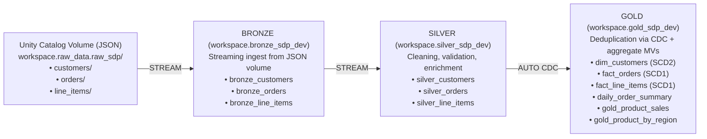

# sdp_medallion — Medallion Pipeline

Serverless Lakeflow Spark Declarative Pipeline (SQL) implementing a Bronze → Silver → Gold medallion architecture over raw JSON data in `workspace.raw_data.raw_sdp`.

---

## Source data

| Volume path | Entity | Rows |
|---|---|---|
| `/Volumes/workspace/raw_data/raw_sdp/customers` | Customers | ~100 |
| `/Volumes/workspace/raw_data/raw_sdp/orders` | Orders | ~500 |
| `/Volumes/workspace/raw_data/raw_sdp/line_items` | Line items | ~1,500 |

---

## Folder structure

---

## Architecture Overview





## Repository Structure

```
src/sdp_medallion_etl/
├── explorations/               # Ad-hoc notebooks for data exploration
└── transformations/
    ├── bronze/                 # Raw ingestion — streaming tables with schema evolution
    │   ├── bronze_customers.sql
    │   ├── bronze_orders.sql
    │   └── bronze_line_items.sql
    ├── silver/                 # Cleaned & enriched — streaming tables, no deduplication
    │   ├── silver_customers.sql
    │   ├── silver_orders.sql
    │   └── silver_line_items.sql
    └── gold/                   # Business-ready — SCD tables & aggregate materialized views
        ├── dim_customers.sql           (SCD Type 2)
        ├── fact_orders.sql             (SCD Type 1)
        ├── fact_line_items.sql         (SCD Type 1)
        ├── gold_sales_by_region_monthly.sql   (Materialized View)
        └── gold_product_sales_metrics.sql     (Materialized View)
```

---

## Schemas (dev)

| Layer | UC Schema | Table type |
|---|---|---|
| Bronze | `workspace.bronze_sdp_dev` | STREAMING_TABLE |
| Silver | `workspace.silver_sdp_dev` | STREAMING_TABLE |
| Gold (SCD) | `workspace.gold_sdp_dev` | STREAMING_TABLE (AUTO CDC) |
| Gold (agg) | `workspace.gold_sdp_dev` | MATERIALIZED_VIEW |

Schemas are parameterised in `databricks.yml` (`bronze_schema`, `silver_schema`, `gold_schema`) and passed to the pipeline via `configuration:` in `resources/sdp_medallion_etl.pipeline.yml`.

---

## Layer design

### Bronze
- Reads JSON files with `STREAM read_files(...)` (Auto Loader behaviour)
- `schemaEvolutionMode => 'rescue'` — unexpected fields captured in `_rescued_data`
- `schemaHints` enforce correct column types (DATE, DOUBLE, INT)
- Metadata columns added: `_ingested_at`, `_source_file`, `_source_file_modified_at`
- `delta.enableChangeDataFeed = true` — required for silver streaming reads
- `delta.columnMapping.mode = name` — supports additive schema changes without rewrites
- Clustered by primary key (Liquid Clustering

| Table               | Cluster By                 | Source Path                        |
|---------------------|----------------------------|------------------------------------|
| bronze_customers    | customer_id                | `.../raw_data/customers/`          |
| bronze_orders       | order_date, customer_id    | `.../raw_data/orders/`             |
| bronze_line_items   | order_id                   | `.../raw_data/line_items/`         |

### Silver
- Streams from bronze tables via `STREAM(workspace.bronze_sdp_dev.*)`
- Transformations: trim/lowercase strings, normalise status to UPPER, derive `order_year`/`order_month`, compute `line_total = quantity × unit_price`
- Adds `is_valid` boolean flag — does not drop rows; deduplication intentionally deferred
- `delta.enableChangeDataFeed = true` — required for gold AUTO CDC

### Gold — SCD tables (AUTO CDC)

| Table | Source | Strategy | Key |
|---|---|---|---|
| `dim_customers` | `silver_customers` | SCD Type 2 | `customer_id` |
| `fact_orders` | `silver_orders` | SCD Type 1 | `order_id` |
| `fact_line_items` | `silver_line_items` | SCD Type 1 | `line_item_id` |

- **SCD Type 2** (`dim_customers`): any business-column change closes the old row (`__END_AT` set) and opens a new one (`__START_AT` set). Pipeline metadata columns (`_ingested_at`, `_source_file`) are excluded from change tracking.
- **SCD Type 1** (`fact_orders`, `fact_line_items`): latest value per key overwrites the previous row — no history retained.
- `SEQUENCE BY _ingested_at` determines which version is current when the same key appears more than once.

Query current customer records:
```sql
SELECT * FROM workspace.gold_sdp_dev.dim_customers WHERE __END_AT IS NULL;
```

### Gold — Aggregate materialized views

| View | Joins | Key metrics |
|---|---|---|
| `gold_sales_by_region_monthly` | `fact_orders` × `dim_customers` (current rows) | order count, unique customers, total/avg/min/max revenue, revenue by status — grouped by region × membership tier × month |
| `gold_product_sales_metrics` | `fact_line_items` × `fact_orders` | units sold, total revenue, avg/min/max unit price, avg qty per order, first/last sold date, order reach |

---

## Unity Catalog Layout

```
workspace
├── demo_dw_raw        (schema)
│   └── raw_data       (volume — JSON source files)
├── bronze_dev         (schema)
│   ├── bronze_customers
│   ├── bronze_orders
│   └── bronze_line_items
├── silver_dev         (schema)
│   ├── silver_customers
│   ├── silver_orders
│   └── silver_line_items
└── gold_dev           (schema)
    ├── gold_dim_customers
    ├── gold_fact_orders
    ├── gold_fact_line_items
    ├── gold_daily_order_summary
    └── gold_product_performance
```

---

## Installed Claude Code Skills (used in this project)

The `.claude/skills/` directory contains Claude Code skills from the Databricks AI Dev Kit. The following are relevant to this project:

| Skill | Purpose in this project |
|---|---|
| `databricks-spark-declarative-pipelines` | Authoring and deploying the Bronze/Silver/Gold SDP pipeline |
| `databricks-synthetic-data-gen` | Generating synthetic retail data via `generate_retail_data.py` |
| `databricks-unity-catalog` | Managing schemas, volumes, and Delta tables in Unity Catalog |
| `databricks-aibi-dashboards` | Building and deploying the Executive Business Dashboard |
| `databricks-jobs` | Scheduling and running pipeline jobs |
| `databricks-config` | Managing workspace profiles and connections |
| `databricks-dbsql` | Writing and testing SQL against Databricks SQL warehouses |
| `databricks-bundles` | CI/CD deployment of pipeline assets across environments |
| `databricks-python-sdk` | Programmatic Databricks API access |
| `databricks-metric-views` | Defining governed business metrics on top of Gold layer tables |
| `databricks-docs` | Reference documentation for unfamiliar Databricks features |

---
---

## Deploying and running

```bash
# Validate bundle config
databricks bundle validate

# Deploy to dev (default target)
databricks bundle deploy

# Run the full pipeline
databricks bundle run sdp_medallion_etl

# Run a single transformation (e.g. bronze only)
databricks bundle run sdp_medallion_etl --select bronze_customers

# Deploy to production
databricks bundle deploy --target prod
databricks bundle run sdp_medallion_etl --target prod
```

---
## Prerequisites

- Databricks workspace with Unity Catalog enabled
- Serverless compute (used by both the data generator and SDP pipeline)
- `databricks-connect >= 16.4, < 17.4` for running `generate_retail_data.py` locally
- Python packages: `faker`, `numpy`, `pandas`


## References

- [Lakeflow Spark Declarative Pipelines docs](https://docs.databricks.com/aws/en/ldp/)
- [SQL language reference](https://docs.databricks.com/aws/en/ldp/developer/sql-dev)
- [AUTO CDC / SCD](https://docs.databricks.com/aws/en/ldp/cdc)
